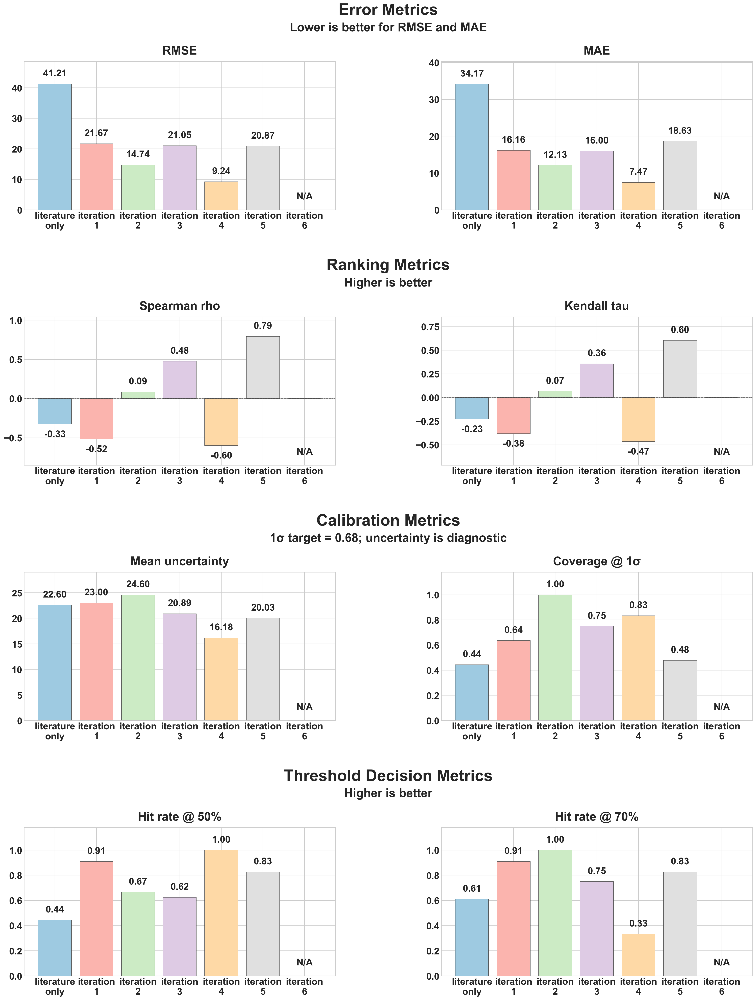

# Step 4: Validation Loop

## Overview

This module integrates wet lab validation results to iteratively refine the GP model. It includes three scripts with different approaches for incorporating validation data.

## Scripts

| Script | Method | Best For |
|--------|--------|----------|
| `update_model.py` | Simple concatenation | Baseline (no weighting) |
| `update_model_weighted_simple.py` | Sample duplication (10x) | Quick experiments, first iterations |
| `update_model_weighted_prior.py` | Prior mean + correction | When literature has systematic bias |
| `evaluate_iterations.py` | Stage-based batch scoring | Measuring whether frozen model outputs and candidate ranks improved over the actual wet-lab sequence |

## Workflow

```
┌─────────────────┐
│  Train Model    │  ← Literature data
└────────┬────────┘
         │
         ▼
┌─────────────────┐
│   Optimize      │  → Candidate formulations
└────────┬────────┘
         │
         ▼
┌─────────────────┐
│   Wet Lab       │  → Validation results
└────────┬────────┘
         │
         ▼
┌─────────────────┐
│  Update Model   │  ← Combined data (WEIGHTED)
└────────┬────────┘
         │
         └──────────→ (Repeat)
```

## Usage

### First Time Setup

```bash
cd "/path/to/project"
python src/04_validation_loop/update_model.py
```

This creates a validation template at `data/validation/validation_template.csv`.

### After Wet Lab Experiments

1. Copy template to `data/validation/validation_results.csv`
2. Fill in experimental viability values
3. Choose and run a script:

```bash
# Option 1: No weighting (original)
python src/04_validation_loop/update_model.py

# Option 2: Simple weighting (10x duplication)
python src/04_validation_loop/update_model_weighted_simple.py

# Option 3: Prior mean + correction
python src/04_validation_loop/update_model_weighted_prior.py
```

### Filter Out Already-Tested Candidates

To compare saved candidate files against `data/validation/validation_results.csv` and
print only the formulations that have not yet been tested:

```bash
python filter_tested_candidates.py
```

The script:
- asks which iteration to inspect
- uses the highest-numbered available candidate iteration when you press Enter on a blank prompt
- checks both standard and BO candidate CSVs for that iteration
- writes filtered outputs to `Untested/Iteration X/` as `*_untested.csv` and `*_untested_summary.txt`
- matches formulations using the same rounded text precision shown in the candidate summaries

### Evaluate Model Stages Against Wet-Lab Batches

To score the frozen literature-only and iteration-specific outputs against the
wet-lab batches they actually produced:

```bash
python src/04_validation_loop/evaluate_iterations.py
```

The evaluator uses the project's current experiment sequence:

- result files without an iteration suffix map to the literature-only stage and are scored on `EXP101` to `EXP306`
- when present, the evaluator loads that baseline from `models/literature_only/` instead of borrowing the literature component from iteration 1
- `iteration_1_*` outputs are scored on `EXP1101` to `EXP1206`
- `iteration_2_*` outputs are scored on `EXP2101` to `EXP2106`
- `iteration_3_*` outputs remain pending until those validation rows are added

Outputs:

- `results/evaluation/iteration_prospective_summary.json`
- `results/evaluation/iteration_prospective_metrics.csv`
- `results/evaluation/stage_performance.png`

The evaluator reports two kinds of evidence:

- batch-level predictive metrics: RMSE, MAE, Spearman, Kendall, uncertainty coverage, and threshold hit rates
- candidate rank cross-reference: which validation rows exactly match frozen candidate lists, including their original rank at selection time

### Generate the Next Validation Batch

The evaluation outputs are now one of the inputs to the dedicated next-batch
generator in `src/07_next_formulations/next_formulations.py`:

```bash
python src/07_next_formulations/next_formulations.py
```

That script is separate from the update loop on purpose:

- `04_validation_loop` measures how the frozen stages performed
- `07_next_formulations` uses the latest completed stage residuals plus active BO outputs to choose the next 10 formulations
- the split is fixed at 5 exploitation + 5 exploration/calibration
- the run is strict: it fails before writing if the active stage, validation stage sequence, or required BO artifacts are inconsistent

### ⚠️ Before Running Any Update Script

> **These scripts overwrite the active model in `models/`.** Run them on a branch or commit your working tree first so you have a clean rollback point.

## Validation CSV Format

The CSV uses **full feature names** with `_M` (molar) or `_pct` (percentage) suffixes to match the model's feature names:

```csv
experiment_id,experiment_date,viability_measured,notes,acetamide_M,betaine_M,...,dmso_M,...,ethylene_glycol_M,fbs_pct,...,glycerol_M,...,hsa_pct,...,trehalose_M
EXP101,2026-02-04,21.01,"33.0mM DMSO + 2.07M ethylene glycol",0,0,...,0.033,...,2.07,0,...,0,...,0,...,0
EXP205,2026-02-11,63.31,"34.7% FBS + 2.35M glycerol + 6.0% HSA",0,0,...,0,...,0,34.7,...,2.35,...,6,...,0
```

**Notes**:
- Columns include all 34 ingredient features — set unused ingredients to `0`
- Molar concentrations (`_M`) are in **mol/L** (e.g., 33 mM DMSO → `0.033`)
- Percentage ingredients (`_pct`) are in **%** (e.g., 34.7% FBS → `34.7`)
- Use the `validation_template.csv` as a starting point to ensure all columns are present

## Weighting Approaches

### Option A: Sample Duplication (`update_model_weighted_simple.py`)

Each wet lab sample is duplicated 10x before combining with literature data.

**Configuration** (edit at top of script):
```python
VALIDATION_WEIGHT_MULTIPLIER = 10  # Increase for more wet lab influence
```

**Pros:**
- Simple and intuitive
- Works with standard GP
- Easy to tune

### Option B: Prior Mean + Correction (`update_model_weighted_prior.py`)

Uses literature GP as prior mean, wet lab GP models corrections.

**Configuration:**
```python
ALPHA_LITERATURE = 1.0   # Higher noise = less trusted
ALPHA_WETLAB = 0.02      # Lower noise = more trusted  (50x trust ratio)
```

**Pros:**
- Corrects systematic biases
- Meaningful uncertainty
- Works with very few samples

**Output:** Creates a `CompositeGP` model with both components.

## Model Selection Behavior

Each update script stamps the trained iteration with explicit identity fields:
- `iteration`
- `iteration_dir`
- `model_method`
- `is_composite_model`

The same identity is also appended to `data/validation/iteration_history.json`.

Downstream scripts use the active metadata in different ways:

- `update_model.py` and `update_model_weighted_simple.py` mark the active model as **standard GP**
- `update_model_weighted_prior.py` marks the active model as **composite GP**
- `03_optimization`, `05_bo_optimization`, and `06_explainability` share the same iteration-aware resolver
- the shared resolver validates metadata against iteration history and does **not** fall back automatically across model types
- each update script writes `models/<iteration_dir>/observed_context.csv` and mirrors the active copy to `models/observed_context.csv`
- `03`, `05`, and `06` all load that observed context first and reconstruct it on demand if it is missing

Whenever an update script activates a newly trained iteration by replacing `models/model_metadata.json`, it prints a notice that the active metadata is being overwritten and identifies the target iteration/method.

## Output

- Trained checkpoint in `models/iteration_N_<method>/`
- Active model mirror in `models/`
- **Observed context** in `models/iteration_N_<method>/observed_context.csv` and `models/observed_context.csv`
- **Compatibility evaluation data** in `data/processed/evaluation_data.csv` (mirror written by `update_model_weighted_prior.py`)
- Iteration history in `data/validation/iteration_history.json`

The canonical observed context CSV includes a `context_weight` column (1.0 for literature, weighted values for wet lab), a `source` column, and iteration identity fields. `03`, `05`, and `06` use this file as the source of truth for the active iteration. The compatibility evaluation data CSV keeps the `weight` column for prior-mean compatibility only.

## Iteration Tracking

Each iteration is logged with:
- Timestamp
- Iteration number and iteration directory
- Model method and whether the model is composite
- Number of validation samples
- Wet-lab cross-validated RMSE (`validation_rmse`)
- Wet-lab in-sample RMSE (`wetlab_train_rmse` in model metadata)
- Weighting method and parameters

## Current Evaluation Snapshot

Latest outputs in `results/evaluation/` show:

| Stage | Rows | RMSE | Spearman | Hit Rate @ 50% |
|------|------|------|----------|----------------|
| Literature only | 18 | 41.21 | -0.327 | 0.444 |
| Iteration 1 | 11 | 21.67 | -0.518 | 0.909 |
| Iteration 2 | 6 | 14.74 | 0.086 | 0.667 |
| Iteration 3 | 8 | 21.05 | 0.476 | 0.625 |
| Iteration 4 | 0 | N/A | N/A | N/A |

This means the model improved in rank ordering for iteration 3, but it is still
not a well-calibrated viability predictor. The new `07_next_formulations` step
exists to spend part of the next wet-lab batch on calibration probes instead of
only chasing the highest predicted formulations.


